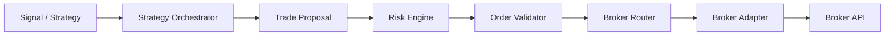
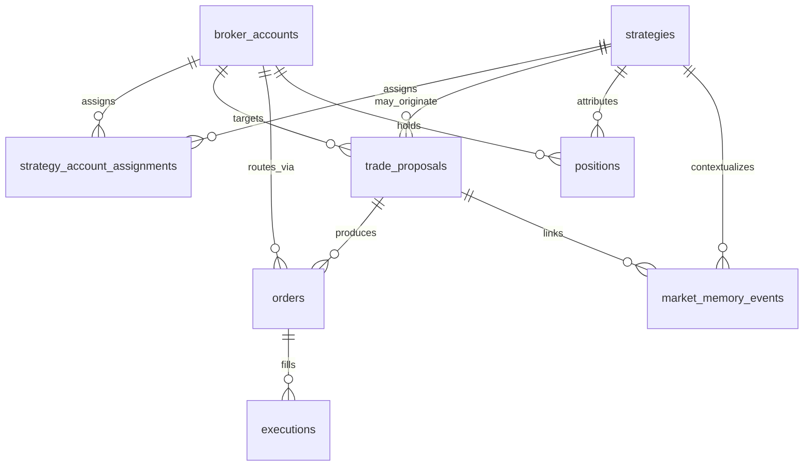

# Version 1 Trading Database Schema

Schema-only foundation for the future trading pipeline. No broker adapters,
strategy execution, risk engine, or live trading logic is implemented yet.

## Pipeline (planned)



## Tables

| Table | Purpose |
|---|---|
| `broker_accounts` | Multiple accounts across brokers; **defaults to `paper`**; no API secrets |
| `strategies` | Strategy metadata / lifecycle status only |
| `strategy_account_assignments` | Many-to-many strategy ↔ account with per-assignment risk knobs |
| `trade_proposals` | Required pre-order intent from any source (strategy, AI, manual, …) |
| `orders` | Broker-facing orders linked to a proposal |
| `executions` | Fills (many per order); `Numeric(24,8)` prices/qty |
| `positions` | Open/closed positions; **not unique by symbol alone** (strategy-aware) |
| `risk_policies` | Scoped limits (`global` / account / strategy / assignment) |
| `audit_events` | Append-oriented audit trail (`JSONB` details; no secrets) |
| `market_memory_events` | Minimal market-context storage for future memory features |

## Relationships (high level)



## Delete behavior (safety)

- **RESTRICT**: deleting a broker account / proposal / order that still has
  dependent historical rows (`orders`, `executions`, `trade_proposals`,
  `positions`) is blocked.
- **SET NULL**: optional links (`strategy_id` on proposals/positions/memory)
  are nulled if the strategy is removed; history remains.
- **CASCADE**: only `strategy_account_assignments` junction rows.

Audit events have **no FK** to entities so the trail cannot be wiped by
parent deletes.

## Money / precision

Financial columns use `NUMERIC(24, 8)` (not floating point).

## Migration

- Revision ID: `111d98cf92b8`
- File: `backend/migrations/versions/111d98cf92b8_v1_trading_schema.py`

```bash
cd backend
# DATABASE_URL must point at the intended development database
alembic upgrade head
```

Do not store broker credentials in these tables.
