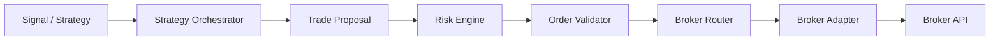
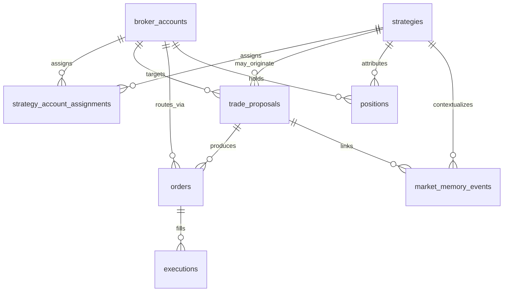

# Version 1 Trading Database Schema

Schema-only foundation for the future trading pipeline. No broker adapters,
strategy execution, risk engine, or live trading logic is implemented yet.

## Safety principles

- **New broker accounts** default to `trading_mode = paper` and `is_enabled = false`.
- **New strategy ↔ account assignments** default to paper and disabled.
- Nothing is tradable until an operator explicitly enables it.
- Database constraints are **defense-in-depth**. They do **not** replace the
  future Risk Engine.
- No trade execution component may bypass:

```
Trade Proposal → Risk Engine → Order Validator → Broker Router → Broker Adapter
```

## Pipeline (planned)



## Tables

| Table | Purpose |
|---|---|
| `broker_accounts` | Multiple accounts across brokers; **PAPER + DISABLED by default**; no API secrets |
| `strategies` | Strategy metadata / lifecycle status only |
| `strategy_account_assignments` | Many-to-many strategy ↔ account; **PAPER + DISABLED by default** |
| `trade_proposals` | Required pre-order intent (`stop_price` ≠ `stop_loss_price`) |
| `orders` | Broker-facing orders linked to a proposal; own `time_in_force` |
| `executions` | Fills (many per order); `Numeric(24,8)` prices/qty |
| `positions` | Open/closed positions; **not unique by symbol alone** (strategy-aware) |
| `risk_policies` | Scoped limits; `require_stop_loss` defaults **true** |
| `audit_events` | Append-oriented audit trail (`JSONB` details; no secrets) |
| `market_memory_events` | Minimal market-context storage for future memory features |

## Key invariants

| Invariant | Enforcement |
|---|---|
| Order account matches proposal account | Composite FK `orders(trade_proposal_id, broker_account_id) → trade_proposals(id, broker_account_id)` |
| Positive quantities / non-negative prices | CHECK constraints |
| Valid enums (mode, side, status, TIF, …) | CHECK constraints |
| Broker + external account uniqueness | UNIQUE `(broker, external_account_id)` |
| Strategy name + version uniqueness | UNIQUE `(name, version)` |
| One open position per account+strategy+symbol+asset | Partial unique index (multi-strategy same symbol allowed) |
| Risk policy scope uniqueness | Partial unique indexes |

### Proposal stop semantics

| Field | Meaning |
|---|---|
| `stop_price` | Trigger price when the **entry** order itself is stop / stop-limit |
| `stop_loss_price` | Protective **exit** level for the resulting position / trade plan |

`stop_loss_price` is optional at insert time; the Risk Engine decides when it is required.

## Relationships (high level)



## Delete behavior (historical protection)

- **RESTRICT** on trading-history FKs: broker accounts, strategies, proposals,
  orders → dependents (`trade_proposals`, `orders`, `executions`, `positions`,
  `market_memory_events`). Deleting a parent that still has history is blocked.
- **CASCADE** only on `strategy_account_assignments` (configuration junction).
- Audit events have **no FK** to entities so the trail cannot be wiped by
  parent deletes.

## Money / precision

Financial columns use `NUMERIC(24, 8)` (not floating point). Risk percent fields
use `NUMERIC(8, 4)`.

## Migrations

| Revision | Purpose |
|---|---|
| `111d98cf92b8` | Base Version 1 trading schema |
| `a86f3472f808` | Safety hardening (defaults, stops, TIF, composite FK, CHECKs, RESTRICT) |

```bash
cd backend
# DATABASE_URL must point at the intended development database
alembic upgrade head
```

Do not store broker credentials in these tables.

See also: [abandoned-schema-0001-safety-reference.md](./abandoned-schema-0001-safety-reference.md)
  for safety concepts recovered from the abandoned live `0001` lineage.
